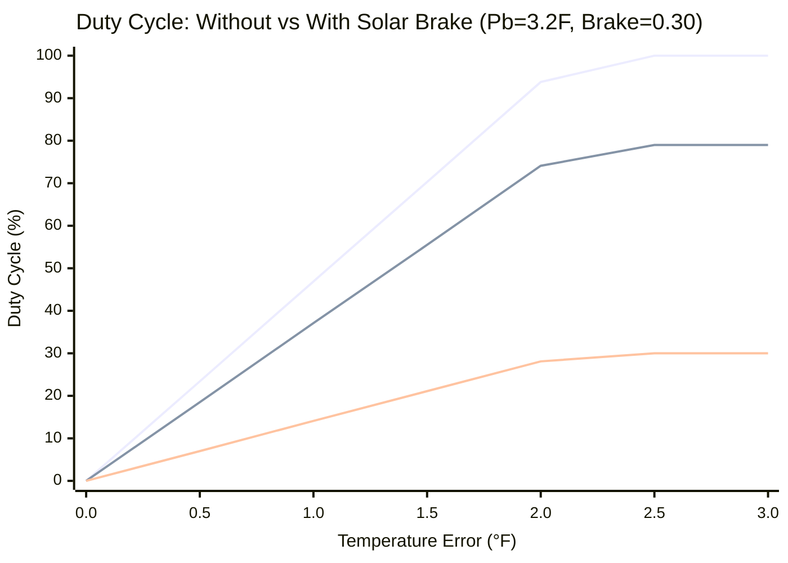

# Thermal Invariant Engine

## What This Is

The Thermal Invariant Engine is the real-time control firmware for a **13-zone radiant hydronic heating system** in a residential home at 7,000' elevation. All three software layers — **CODESYS** (PLC runtime), **Node-RED** (weather intelligence), and **Home Assistant** (device driver/UI) — run on a single **RevPi Connect 5** industrial computer, communicating over local Modbus TCP. A **RevPi RO module** provides relay outputs for snowmelt contact switch control. The PLC task executes at a 20ms scan rate.

The system manages:
- **13 radiant floor heating zones** across two slab types: 5" poured concrete (~210 tons) on the garage and main floor, and 1.5–2" gypcrete over-pour (~24–32 tons) on the upper floor — over **230 tons** of total thermal mass
- **Laars FT399 condensing boiler** — rated 399,000 BTU/hr at sea level, derated ~25% at 7,000' altitude. The effective minimum fire rate is approximately 32,000 BTU/hr. The boiler is configured with a **15°F CH (central heating) temperature differential** between supply and return, which maximizes BTU extraction per firing cycle by allowing the return water to cool significantly before recirculating. This wider differential means the system pulls more heat out of each gallon of water, enabling longer intervals between firing cycles and higher condensing efficiency.
- **13 zone valves** (wax actuators on hydronic manifolds, driven by Ecobee call-for-heat signals)
- **Caleffi zone controllers** (detect flow demand, activate circulator pump and boiler)
- **5 forced-air handlers** for temperature equalization between zones
- **2 snowmelt relay outputs** (driveway and outdoor patios — not yet implemented)

## Project Goals

### Primary: Comfort Through Physics
Radiant floor heating has enormous thermal inertia. A concrete slab takes 45–90 minutes to respond to a temperature change. The goal of this system is to maintain consistent, comfortable floor temperatures by respecting the physical constraints of high-mass systems — never short-cycling valves, never starving zones of heat, and always delivering the right supply water temperature for the current weather conditions.

### Secondary: Efficiency Without Sacrifice
The system minimizes fuel consumption through weather-responsive control:
- **Outdoor Reset (ODR)** adjusts supply water temperature based on outdoor conditions, delivering only the heat needed
- **Solar Brake** reduces heating load when solar gain is forecast, preventing overheating and wasted fuel
- **Pre-Charge Boost** proactively heats the slab before a cold front arrives, using the building's thermal mass as a battery
- **Feed-Forward Injection** sets a minimum duty floor during pre-charge events, ensuring every zone gets a head start

### Tertiary: Fail-Safe by Default
Every design decision defaults to safety. If Node-RED goes offline, weather data goes stale, or sensors report bad data, the system defaults to a **load factor of 1.0** — no solar brake reduction, no pre-charge boost, just straight PID control against the ODR curve. The smart flywheel optimizations (forecast-based braking, pre-charge, feed-forward) are lost, but the PID still delivers proportional heat based on measured error. The house heats less efficiently but never freezes due to a software failure. Zones with sensors below 32°F or thermostat modes set to "off" are automatically disabled to prevent runaway heating on bad data.

### Why Not Just Use the Ecobees?

A stock Ecobee installation — 13 independent thermostats each calling for heat on their own schedule — *works*, but it creates significant problems for a multi-zone hydronic system:

**Load coalescing.** Independent thermostats have no awareness of each other. If 13 independent zones all fire a few minutes apart from each other, a high-efficiency condensing boiler is forced to "short-cycle"—turning on, running for 5 minutes for a single small bathroom, and shutting down. This destroys efficiency and boiler lifespan. The Invariant Engine's Governor actively *coalesces* demand. It waits until enough aggregate load exists (e.g., waiting for that bathroom *and* a bedroom to need heat), and then synchronizes their valve openings. By doing this, the boiler fires less often, but runs for longer, steadier intervals in its peak condensing efficiency zone. The system enforces minimum run times and prevents specific zones from "freelancing" with small demands during boiler rest periods.

**Gentler heat delivery.** Ecobees use simple bang-bang control (on/off at a fixed deadband). For radiant floors, this produces temperature swings — the slab overshoots because the wax valve was open too long, then undershoots because it was off too long. The PLC's velocity-form PID with 30–60 minute slow PWM delivers proportional heat: a zone that needs a little heat gets a 20% duty cycle (12 minutes on, 48 minutes off), not a full blast followed by nothing. This produces dramatically more even floor surface temperatures.

**Weather-responsive supply temperature.** The boiler runs a custom outdoor reset (ODR) curve that varies supply water temperature from 85°F to 120°F based on outdoor conditions. This is great for efficiency, but it breaks Ecobee's learning algorithms — the thermostat tries to learn "how long should I run to raise the room 1°F," but the answer changes constantly because the supply water temperature changes with the weather. On a 40°F day the water is 95°F and it takes 45 minutes; on a 5°F day the water is 118°F and it takes 20 minutes. The Ecobee can never converge on a stable model, leading to erratic run times, overshoot, and undershoot. The PLC's PID controller doesn't need to learn — it directly measures the error and computes proportional output every scan, adapting instantly to whatever supply temperature the ODR curve is delivering.

**Solar gain awareness.** When the sun is heating the house through south-facing windows, stock Ecobees don't know and keep firing until the room overshoots their deadband. The PLC's solar brake proactively reduces duty based on forecasted solar gain, preventing overshoot and saving fuel. Because the brake uses *forecast* data from Node-RED (not just current lux readings), it can act hours before the sun arrives:

- **Extreme example (clear day, 35°F forecast):** Tomorrow's forecast shows full sun with a high of 35°F. Node-RED calculates that south-facing windows will contribute significant solar gain starting around 9 AM. The brake factor drops to 0.5 (50% duty reduction) and is applied as early as **2–3 AM** — the system begins pulling duty from the floors overnight, allowing the slab to coast into sunrise with stored thermal mass instead of pumping in heat that the sun will duplicate in a few hours. By the time solar gain peaks at noon, the floors are warm but not overcharged, and the boiler barely fires all afternoon.

- **Mild example (partly cloudy, 25°F):** The forecast shows intermittent clouds with some sun. Node-RED calculates a modest brake factor of 0.8 (20% reduction). The system trims duty slightly — a zone that would normally run at 40% duty runs at 32% instead. If clouds dominate and the lux sensor reads low, the brake releases back to 1.0 within minutes. The system shaves fuel without risking comfort.

**Real-time BTU telemetry.** Stock Ecobees report binary on/off. The Invariant Engine calculates per-zone thermal-scaled BTU delivery in real time — accounting for supply water temperature, duty cycle, and rated zone capacity — giving accurate energy monitoring and enabling data-driven tuning.

**Coordinated air quality.** Stock fan systems run on fixed timers with no awareness of zone temperatures or humidity. The Air Marshal monitors temperature and humidity spreads across zone groups and actively shuttles conditioned air where it's needed, while maintaining a baseline filtration schedule.

**Pre-charge intelligence.** When a cold front is forecast, the system proactively charges the slab thermal mass *before* the temperature drops. Stock thermostats are purely reactive — they don't start heating until the room is already cold, by which point the slab needs hours to catch up.

### Near-MPC Without the Complexity

Model Predictive Control (MPC) is the gold standard for optimizing HVAC systems with significant thermal mass. A true MPC implementation builds a mathematical model of the building, predicts future temperatures over a rolling horizon, and solves a constrained optimization problem every timestep to find the cheapest control trajectory.

This system achieves most of the same outcomes through **heuristic rules layered on top of PID**, without requiring a building model or optimization solver:

| MPC Capability | This System's Equivalent |
|---|---|
| **Predict future disturbances** | Solar brake uses weather *forecast* data, acting hours ahead (2–3 AM preemption) |
| **Anticipatory pre-heating** | Pre-charge boost proactively charges slabs before forecast cold fronts |
| **Weather-responsive setpoints** | ODR curve adjusts supply water temperature continuously based on outdoor conditions |
| **Minimize energy while maintaining comfort** | Solar brake reduces duty without cutting it to zero — slab stays warm with headroom for absorption |
| **Coordinate multiple zones** | Governor coalesces load, enforces firing coordination, prevents zone freelancing |
| **Respect physical constraints** | Zone Invariant hard-enforces MinRun/MinOff timing; Governor enforces boiler rest periods |
| **Adapt to changing conditions** | Velocity PID adapts instantly to supply temp changes; brake releases within minutes if forecast changes |

**Why this is better than implementing MPC for this application:**

- **No model to get wrong.** MPC requires an accurate thermal model of the building — wall R-values, thermal mass per zone, infiltration rates, window solar heat gain coefficients. These are notoriously difficult to identify correctly in a real building, and a bad model makes MPC *worse* than simple PID. This system needs no model; it reacts to measured temperatures and forecast weather.

- **Extrapolation failure on extreme conditions.** An auto-learning MPC identifies its thermal model from observed data. If the coldest night during the training period was 5°F, the model has never seen how the building behaves at −20°F. When a freak cold snap hits, the model extrapolates linearly — underestimating non-linear effects like increased infiltration, window heat loss, and ground-contact losses at extreme temperatures. The optimizer plans a control trajectory based on a model that's wrong for these conditions, and by the time the state estimator corrects (actual temps diverge from predicted), the system is already 2–3°F behind in a plant with 60+ minute thermal lag. **This system handles −20°F with zero special logic** — the ODR curve clamps at 120°F supply water, the PID may run at maximum duty, and the Governor holds the boiler in continuous firing. Every component responds proportionally to measured conditions with no model to extrapolate.

- **ODR and differential coupling.** The boiler's outdoor reset curve varies supply water temperature from 85°F to 120°F — a 41% range — which changes the plant gain continuously. The same valve-on duration delivers vastly different BTUs at different outdoor temperatures. Combined with the 15°F CH differential (non-linear intra-cycle BTU delivery as the slab approaches supply water temperature), the model needs to capture a three-dimensional surface that changes with outdoor temp, slab state, and cycle timing. This system's PID is fully decoupled from supply water temperature — it measures room temperature error and adjusts duty, adapting naturally to whatever BTU rate the ODR curve is delivering.

- **Multi-zone coupling complexity.** A 13-zone system has 78 thermal boundaries (zone-to-zone heat transfer paths), each with different coupling coefficients depending on shared wall area, insulation, and door openings. When multiple zones are simultaneously active, hydraulic coupling changes flow rates per zone (shared circulator), altering BTU delivery. The Governor's load batching introduces variable dead time that looks random to the model. Each zone's PID controller operates independently — it doesn't need to know what any other zone is doing. Cross-coupling effects are simply disturbances that the PID absorbs on the next cycle.

- **Occupancy and infiltration sensitivity.** A residential MPC model is trained on a typical 2–4 person household. When 15 guests arrive for the holidays — adding ~1,500 BTU/hr of body heat, oven running for hours, doors opening repeatedly — the model's disturbance predictions are wrong. Wind-driven infiltration adds another unmodeled variable: a 30 mph wind can increase total building heat loss by 25–35% compared to calm conditions at the same temperature, primarily through air leakage that varies non-linearly with wind speed, direction, and building orientation. These disturbances are difficult to identify and impossible to predict. This system's PID simply measures the temperature change and adjusts — no occupancy model or infiltration coefficient needed.

- **Deterministic and auditable.** Every decision the PLC makes can be traced to a specific rule: "the brake is at 0.30 because the forecast says sunny and it's 30°F outside, and the Mudroom has fSolarSensitivity=1.0." MPC produces optimal-but-opaque control trajectories that are difficult to debug when something goes wrong at 2 AM.

- **Runs on a PLC at 20ms.** MPC solvers (QP, MILP) require significant compute — typically a server running Python or Julia with a dedicated optimization library. This system's rules evaluate in microseconds on industrial hardware with no operating system dependencies, no Python runtime, no network calls to a cloud optimizer. A compute failure in MPC means no control; a Node-RED failure here means fallback to straight PID.

- **No training period vulnerability.** Auto-learning MPC needs 1–2 weeks of data collection to identify the building's thermal model. During that window, the system is either running open-loop (no optimization at all) or using a partially-identified model that may be dangerously inaccurate. Seasonal changes (first cold snap of winter, first sunny spring day) require re-identification. This system works correctly from the first boot with manually-configured parameters.

- **Graceful degradation.** If the weather forecast is wrong or stale, the system falls back to straight PID at load factor 1.0. MPC with stale forecast data can produce aggressively wrong control actions because the optimizer trusts its predictions.

- **No ongoing maintenance burden.** MPC models drift as the building changes — new furniture absorbs thermal mass differently, window treatments change solar gain coefficients, weatherstripping degrades. A production MPC system requires periodic re-identification and validation. This system's parameters are physical constants (BTU ratings, slab type, solar exposure) that change only when the building physically changes, and adjustments are single-line config edits.

- **Thermal mass is forgiving.** The key insight is that this building has enormous thermal inertia — 5" concrete slab (~210 tons) plus 1.5–2" gypcrete (~24–32 tons), totaling over **230 tons** of thermal mass. The control doesn't need to be *optimal* — it needs to be *roughly right and never catastrophically wrong*. Simple rules like "reduce duty 40% when sunny and above 35°F" capture 90%+ of the MPC benefit without any of the implementation risk.

The system is effectively a **hand-tuned MPC** where the "model" is encoded as ODR curves, brake tables, and pre-charge thresholds, and the "optimizer" is the PID controller adapting in real time. If the rules need adjustment, they're changed in a few lines of config — not by re-identifying a 13-zone thermal model.

## System Architecture

### Three-Tier Control

```
┌─────────────────────────────────────────────────────────────┐
│  HOME ASSISTANT (Driver Layer)                              │
│  Thermostats, sensors, occupancy, UI dashboards             │
│  Writes: setpoints, temps, valve feedback, thermostat modes │
│  Reads: duty cycles, valve states, BTU telemetry            │
└────────────────────┬────────────────────────────────────────┘
                     │ Modbus TCP
┌────────────────────▼────────────────────────────────────────┐
│  NODE-RED (Brain)                                           │
│  Weather forecasts, solar calculations, scheduling          │
│  Writes: outdoor temp, brake factor, forecast data          │
│  Reads: plant state, governor status, zone telemetry        │
└────────────────────┬────────────────────────────────────────┘
                     │ Modbus TCP
┌────────────────────▼────────────────────────────────────────┐
│  CODESYS — THERMAL INVARIANT ENGINE (Body)                  │
│  PID control, PWM timing, valve safety, boiler management   │
│  THIS IS THE FIRMWARE DOCUMENTED HERE                       │
└─────────────────────────────────────────────────────────────┘
```

**Node-RED's weather intelligence:** Node-RED does far more than relay weather data — it computes derived metrics that give the system an advantage over standard ODR curves. It calculates **"feels like" temperature** (wind chill / heat index) and uses that to dynamically adjust the brake factor, because a 30°F day with 25 mph wind loses heat from the building envelope much faster than a calm 30°F day. It also factors in precipitation (rain/snow vetoes solar braking — clouds always accompany precip), forecast confidence, and time-of-day solar angle to produce a composite brake factor that captures the *actual* thermal load on the building, not just the dry-bulb outdoor temperature. This means the system can distinguish between "30°F and sunny" (brake hard — solar gain is coming) and "30°F, cloudy, 20 mph wind" (no brake, boost if anything — the building is bleeding heat). A standard ODR curve with fixed cycle times can't make this distinction.

**Why Home Assistant?** The system uses consumer-grade thermostats (Ecobee, etc.) that communicate via HomeKit — they have no native BACnet or Modbus capability. Home Assistant serves primarily as a **device driver layer**, providing a robust HomeKit controller platform that bridges these consumer devices into the industrial Modbus backbone. It collects temperature readings, setpoints, and thermostat mode commands from the thermostats and writes them to CODESYS registers, while exposing CODESYS outputs (valve states, duty cycles, BTU telemetry) back to the user through dashboards.

**Thermostat valve control — the physical control chain:** The PLC does not wire directly to zone valves or the boiler. Instead, it controls the system **indirectly through thermostat setpoint manipulation**:

```
CODESYS decides       HA writes Ecobee       Ecobee calls        Wax actuator       Caleffi detects
zone should heat  →   setpoint + 2°F     →   for heat        →   opens valve     →   flow, starts
(valve state =        above room temp         ("flame" icon)       on manifold         pump + boiler
 HEATING)                                                    
```

When CODESYS determines a zone valve should open, Home Assistant writes the Ecobee's internal setpoint to **actual setpoint + 2°F**, which triggers the thermostat's call-for-heat. This energizes the wax actuator on the zone valve, which opens and allows hydronic flow. The Caleffi zone controller detects flow demand across the manifold and activates the circulator pump and boiler. When CODESYS closes the valve, HA writes **actual setpoint − 2°F**, ending the call-for-heat and closing the wax actuator.

**Ecobees as dumb sensors:** All of the Ecobee's built-in smart features — Smart Home/Away, Follow Me, eco+, Smart Recovery, schedule learning — are **disabled**. The thermostats are configured as essentially **dumb on/off switches with high-resolution temperature and humidity sensors**. All intelligence lives in CODESYS; the Ecobees exist solely to provide accurate room temperature data and to actuate the wax valves via their call-for-heat relay output. This eliminates conflicts between the Ecobee's built-in algorithms and the PLC's PID control.

**Physical min run times:** Each Ecobee has a **minimum equipment run time** configured directly on the device (matching or shorter than the PLC's `tMinRun`). This provides a hardware-level backstop against rapid valve cycling — even if the HA automation or PLC misbehaves and rapidly toggles setpoints, the Ecobee itself will hold the call-for-heat signal for its configured minimum duration, protecting the wax actuators and preventing short-cycling damage.

**PLC-offline fail-safe:** This architecture provides an inherent fail-safe. If the PLC, Node-RED, or Home Assistant automation goes offline, the Ecobee thermostats retain their **last-written setpoint** (±2°F from the actual target). The system degrades to basic thermostat control — each Ecobee independently calls for heat based on its currently stored setpoint, and the Caleffi controller handles pump/boiler activation on flow demand. The result is a **less efficient but still functional heating system**: zones heat based on the ±2°F offset without PID optimization, weather-responsive ODR, solar braking, or coordinated load management. The house stays warm; it just uses more fuel. No intervention is required — the system simply runs as a conventional thermostat-controlled hydronic setup until the PLC is restored.

This architecture means the PLC is a **supervisory controller** — it makes all timing, PID, and safety decisions, but the physical actuation chain retains the original residential equipment (Ecobee → wax valve → Caleffi → boiler).

The Invariant Engine acts as the **supervisory authority**. Node-RED and Home Assistant set *what* temperature is desired; the Engine decides *how* and *when* to deliver heat while enforcing physical constraints that higher layers cannot violate. The physical actuation happens through the retained Ecobee → wax valve → Caleffi chain.

### Execution Order (Each 20ms Scan)

```
  Step 0: Weather Strategist — compute ODR supply temp, solar brake, feed-forward
  Step 0.1: Persistence Sync — restore/save setpoints and thermostat modes
  Step 1: Safety Check — global lockout from Home Assistant
  Step 1.5: Modbus Unpacking — explicit registers → internal arrays
  Step 2: Zone Controllers ×13 — PID + PWM for each zone
  Step 3: Zone Manager — aggregate load, run energy counters
  Step 3.5: Insufficient Load Check — structural gating for deadlock prevention
  Step 4: Governor — boiler plant state machine
  Step 5: Snowmelt Supervisor — (placeholder)
  Step 5.5: Air Marshal — forced-air equalization
  Step 6: Zone Invariants ×13 — enforce MinRun/MinOff on valve commands
  Step 7: Diagnostics — Modbus output mapping
  Step 8: WebVisu Update — BMS display interface
```

---

## How It Works — Detailed

### 1. Outdoor Reset (ODR) — Supply Water Temperature

The boiler's target supply water temperature is calculated from outdoor temperature using a linear curve:

| Outdoor Temp | Supply Water Temp | Rationale |
|---|---|---|
| ≤ 0°F | 120°F | Maximum heat for coldest conditions |
| 32°F | 102°F | Moderate heating for typical winter |
| 50°F | 93°F | Mild heating for shoulder season |
| ≥ 65°F | 85°F | Minimum — just enough to maintain floor warmth |

The slope is **−0.5385°F supply per °F outdoor** (35°F supply range over 65°F outdoor range).


### 2. Solar Brake — Preemptive Load Reduction

The solar brake is designed to catch the impact of solar gain *before it arrives* without causing comfort issues. Unlike a traditional setback — which cuts the thermostat and turns off the heat entirely, letting the slab go cold — the solar brake **still puts BTUs into the slab**, just at a reduced rate. This keeps the floors warm and comfortable while creating thermal headroom: the slab is slightly below its fully-charged state, so when solar radiation pours through the windows, the thermal mass absorbs that free heat instead of overheating the room. The result is fuel savings without cold floors.

**Primary source:** Node-RED calculates a brake factor (0.4–1.4) using local lux sensors, weather forecasts, precipitation data, and time-of-day logic. This is passed via Modbus as `NR_Brake_Factor`. Values below 1.0 represent solar braking (reducing heat), while values above 1.0 represent pre-charge boosting (proactively adding heat before a forecast cold front). The typical range during solar braking is 0.4–0.8; during pre-charge events the factor reaches 1.2–1.4.

**Fallback:** If Node-RED is offline or data is stale (no sequence counter update in 10 minutes), a built-in step-function provides conservative braking based on outdoor temperature:

| Outdoor Temp | Brake Factor | Effective Load Reduction |
|---|---|---|
| < 10°F | 1.0 | No brake (too cold for meaningful solar gain) |
| 10–15°F | 0.86 | 14% reduction |
| 15–25°F | 0.70 | 30% reduction |
| 25–35°F | 0.50 | 50% reduction |
| 35–45°F | 0.35 | 65% reduction |
| > 45°F | 0.30 | 70% reduction |

The maximum brake (default `ReducePct = 0.70` = 70% max cut at WarmCeiling) scales linearly from 0% at ColdFloor (10°F) to 70% at WarmCeiling (45°F).

### 3. Pre-Charge Boost — Cold Front Preparation

When the 4-hour temperature forecast predicts a significant drop (≥ 5°F decline, landing below 35°F), the system activates pre-charge mode:

- **Brake factor pushed above 1.0** (typically 1.2–1.4), creating a load boost that translates into higher duty cycles and a feed-forward minimum duty floor
- **Solar brake is overridden** — the brake factor cannot remain below 1.0 when a cold front is incoming
- **Hysteresis release**: pre-charge only deactivates when the forecast eases above −4°F for 2 continuous minutes, preventing flicker from Modbus noise or transient forecast updates
- **Immediate release**: if the forecast flips positive (≥ −0.1°F), pre-charge drops instantly

This uses the building's thermal mass as a battery — a well-charged concrete slab can coast through several hours of extreme cold without losing comfort.

### 4. Zone PID Control — Velocity-Form Algorithm

Each zone runs an independent **velocity-form (incremental) PID controller**. Unlike traditional position-form PID, this computes the *change* in output (ΔY) each scan rather than accumulating an integral term:

```
ΔY = Kp × (error - lastError)                    // Proportional on error change
   + (Kp / Ti) × error × dt                      // Integral contribution
   + Kp × Tv × (d_measurement change) / dt       // Derivative on measurement
```

#### Why Standard PID Fails for Radiant

A textbook position-form PID controller assumes the plant responds promptly to control changes. Radiant floor heating violates this assumption spectacularly — the slab has 30–90 minutes of thermal lag between "valve opens" and "floor temperature changes." This creates several problems:

- **Integral windup.** The room is cold, the error is large, and the integral accumulates aggressively. But the slab is already absorbing heat — it just hasn't reached the surface yet. By the time the floor temperature starts rising, the integral has wound up so far that the system massively overshoots. Standard anti-windup (integral clamping, conditional integration, back-calculation) are all band-aids that require careful tuning and still often fail after lockouts or setback recovery.

- **Bang-bang behavior.** With a fast integral time, the PID output snaps to 100% the moment the room is below setpoint and 0% the moment it's above. For a system with 60-minute PWM cycles, this produces the same on/off behavior as a dumb thermostat — all the complexity of PID with none of the benefit.

- **Lockout bomb.** When the governor locks a zone out for 15 minutes (boiler rest), the integral keeps accumulating because the error hasn't changed. When the lockout releases, the PID output explodes — the zone demands 100% duty because it's been "trying" to heat for 15 minutes with no result. This causes overshoot, boiler overload, and fights with other zones.

#### Why Velocity Form Solves This

- **Anti-windup is free.** Output clamping (0% to 100%) IS the anti-windup mechanism. No special integral clamp, no conditional integration, no tracking mode. The integral cannot wind up because ΔY is simply not accumulated when the output is at limits.
- **Natural deceleration.** As temperature rises toward setpoint, the error shrinks, so ΔY shrinks, so duty naturally drops. No glide path or threshold needed.
- **Clean lockout recovery.** When a zone is locked out by the governor, the output stays at its last value when the lockout was entered. When released, it resumes from that point — no integral bomb, no overshoot.
- **Proportional delivery.** The wide proportional band (3.2°F for concrete, 2.0–3.5°F for gypcrete) means the PID ramps duty gradually across a range of error values instead of slamming between 0% and 100%. A room 1.5°F below setpoint gets ~47% duty, not 100%. Combined with the slow PWM, this produces genuinely proportional heat delivery.

#### Why Derivative (D) is Disabled

The derivative term is set to 0.0 for all zones — deliberately. In a typical control system, derivative provides "anticipatory braking" by reacting to the rate of change of temperature, reducing output as the temperature approaches setpoint to prevent overshoot.

In radiant floor heating, derivative is actively harmful for two reasons:

1. **Transport delay kills prediction.** The derivative assumes that the current rate of temperature change will continue. But in a slab system, the rate of change is dominated by *heat that was injected 30–60 minutes ago*, not the current control output. The derivative reacts to old information and makes decisions that are wrong for the current state. It sees temperature rising (from heat applied an hour ago) and cuts duty — just when the slab actually needs more heat to sustain the rise.

2. **Noise amplification in slow systems.** Floor temperature changes are tiny per scan (< 0.001°F). At this resolution, sensor noise and quantization are the dominant signal. The derivative amplifies this noise into duty cycle jitter, causing unnecessary valve cycling. A low-pass filter helps but doesn't solve the fundamental problem — there's no meaningful rate signal to extract at a 20ms scan rate from a system that changes 0.5°F per hour.

The velocity-form PID's built-in natural deceleration (shrinking ΔY as error shrinks) provides all the "braking" needed without derivative's downsides.

**Additional features:**
- **Cold-start catch-up**: If the output is near zero but error is large (> 0.3°F and Y < 0.08), the integral gets a 3× boost to speed up initial response.
- **Dynamic proportional cap**: The accumulated output is capped at 1.5 × Kp × error, preventing integral windup from keeping duty disproportionately high as the zone approaches setpoint.
- **Low-pass derivative filter**: Derivative uses a first-order filter (Tf = TV/5) to smooth out measurement noise (available if Tv is ever enabled for experimentation).
- **Instant cutoff**: When temperature is at or above setpoint (error ≤ 0), output is forced to exactly 0.0.

**Tuning parameters** (per zone, configured in `GVL_Config`):
| Parameter | Concrete Zones | Gypcrete Zones | Units |
|---|---|---|---|
| Kp (proportional band) | 3.2 | 2.0–3.5 | °F |
| Ti (integral time) | 7200 | 3600–7200 | seconds |
| Tv (derivative time) | 0.0 | 0.0 | seconds (disabled) |

Note: `GVL_Config.fKp` is the proportional *band* in °F. It is converted to gain in PLC_PRG as `1.0 / Kp` so a band of 3.2°F = gain of 0.3125.

**Per-zone weather parameters** (configured in `GVL_Config`):
| Parameter | Description | Range |
|---|---|---|
| fPreChargeFactor | Scales the global pre-charge feed-forward for this zone. 1.0 = full boost. 0.0 = no pre-charge. | 0.0–1.0 |
| fSolarSensitivity | Scales the solar brake for this zone. 1.0 = full brake (direct sun zones). 0.0 = ignore brake (no sun exposure). | 0.0–1.0 |

The per-zone brake is calculated as: `fMaxScale = 1.0 - (1.0 - globalBrake) × fSolarSensitivity`. A zone with `fSolarSensitivity = 0.3` (e.g., Guest — below grade, no windows) only sees 30% of the global brake effect, while a zone with `fSolarSensitivity = 1.0` (e.g., Living — large south-facing windows) gets the full brake.

#### Dynamic Proportional Cap (The "Shoulder Season Droop")

To fundamentally guarantee that the thermal mass of the concrete slabs cannot overheat the room, the `FB_PID` block enforces a geometric cut-off on the maximum allowed duty cycle near the setpoint.

```iecst
Y := MIN(Y, KP * fError * 1.5);
```



*   **Without Brake (blue, top):** The maximum duty the PID reaches after the integral winds up over sustained heating. This is calculated as $Kp \times Error \times 1.5$, capped at 100%.
*   **Guest — minimal brake (green, middle):** At `fSolarSensitivity = 0.3`, the zone only sees 30% of the global brake. Effective multiplier = 0.79 (21% cut). Guest is below grade with limited sun angles — it gets most of its heating budget preserved.
*   **Living — full brake (red, bottom):** At `fSolarSensitivity = 1.0`, the zone tracks the global brake exactly. Effective multiplier = 0.30 (70% cut). With 250 ft² of south-facing glass delivering ~20,000 BTU/h, this aggressive brake is necessary.
*   **The gap between lines:** The thermal headroom the brake carves out for solar absorption. At 1.0°F error, the brake cuts Living from 47% to 14% but only cuts Guest from 47% to 37% — a **10% cut** vs **33% cut**.

At maximum brake (0.30), the duty is crushed well below what even pure proportional control would produce. The integral's accumulated contribution is effectively eliminated — a zone at 1.5°F error that would normally run at 70% duty is held to just 21%. This aggressive headroom is justified by the solar analysis: the Living zone alone receives up to 20,000 BTU/h of solar gain on clear days, which fills the thermal void the brake creates.

Notice how the cap physically forces the duty cycle to squeeze down to 0% as it approaches 0.0 on the bottom axis. Even if it is -20°F outside and the slow Integral (Ti=7200s) has spent 8 hours calculating a massive heat "debt," this cap explicitly blocks the boiler from paying that debt as the room nears the setpoint.

#### How the Cap and Solar Brake Work Together

This droop is not a bug — it is a **deliberate thermal strategy** that works in concert with the solar brake intelligence. The geometric cap creates the mechanism; the solar brake exploits it:

1. **Cap creates the ceiling.** The PID's accumulated output (integral) is continuously capped at `KP × error × 1.5`. As the zone approaches setpoint, the cap tightens and forcibly pulls duty down. This manufactures a controlled droop — rooms intentionally sink 0.5–1.5°F below setpoint overnight.

2. **Solar brake cuts into the ceiling.** When the brake is at maximum (0.30), it multiplies the entire output by 0.30, compressing the cap curve dramatically. At 0.5°F error: the unbraked cap allows 23% duty, but the braked cap only allows 7%. The PID cannot compensate because the cap prevents Y from climbing high enough to offset the brake. This is the key — the cap and brake **double-team** the PID, carving out a thermal void in the slab.

3. **Solar gain fills the void.** When the sun arrives, the slab is slightly below its fully-charged state. Instead of the solar radiation pushing a 68.0°F slab to 69.5°F (overshoot), it pushes a 66.5°F slab to 68.0°F (absorbed perfectly). The thermal headroom created by the cap+brake duo absorbs the free solar heat without comfort penalty.

This is why the system produces better results than either component alone — the cap without the brake just creates droop for no reason, and the brake without the cap gets overridden by PID compensation. Together, they create intentional thermal headroom timed to coincide with forecast solar gain.

**Observed droop magnitude:** In practice, the manufactured droop is approximately **1–1.5°F** below setpoint per zone (e.g., rooms settle at 66.5–67.0°F against a 68°F setpoint). The droop scales proportionally with the brake factor — a heavy brake of 0.4 (clear sunny day) produces the full 1.5°F void, while a light brake of 0.8 (partly cloudy) produces only 0.5°F. When the brake releases to 1.0 (no solar expected), the cap still limits duty near setpoint but the PID runs unbraked and the droop narrows to ≤0.3°F — just the natural proportional offset of the velocity-form PID.

**Why the droop doesn't feel cold:** Unlike a traditional thermostat setback — where the system turns off completely and the slab cools for hours, producing a cold floor that radiates discomfort even if the air temperature is acceptable — the manufactured droop **never stops heating**. The PID is still pulsing heat into the floor at a reduced but non-zero duty cycle (15–30% during heavy braking). The slab surface remains warm to the touch because it's continuously receiving heat, just less than the full unbraked amount. A room at 66.5°F with an actively heated floor feels fundamentally different from a room at 66.5°F with a slab that's been cold for 4 hours — radiant heat from the floor surface dominates the occupant's thermal comfort perception, not the air temperature alone. The droop is measurable on a sensor but imperceptible underfoot.

### 5. Feed-Forward Injection

When the Weather Strategist's load modifier exceeds 1.0 (pre-charge active), the excess is extracted as a feed-forward base duty:

```
fFeedForward_Global = MAX(0.0, Strategist.rLoadModifier - 1.0)
fFeedForward_Zone = fFeedForward_Global × zone.fPreChargeFactor
```

Each zone's feed-forward is scaled by its `fPreChargeFactor` — zones with high thermal exposure (e.g., Office at 1.0) get 100% of the pre-charge boost, while zones with less exposure (e.g., PriBath at 0.3) get only 30%.

For each zone, if the room temperature is within 0.5°F above setpoint (not clearly overheated), the duty is the *maximum* of the PID output and the zone's feed-forward value, then scaled by the solar brake. This guarantees a minimum duty floor during pre-charge regardless of PID state, while respecting individual zone temperatures and exposure.

### 6. Slow PWM — Valve Timing

PID output (0–100% duty) is converted to valve ON/OFF timing using a slow PWM with configurable period:

- **Concrete zones**: 45–60 minute cycles
- **Gypcrete zones**: 30 minute cycles

**Key behaviors:**
- **Latch at cycle start**: The ON-time is calculated and locked when the cycle begins. Mid-cycle duty changes don't affect the current cycle, preventing valve chatter.
- **Gap bridging**: If the calculated OFF-time is less than 5 minutes, the valve stays on for the entire period — a 5-minute off period isn't worth the valve actuator wear.
- **Safety catch**: If the valve was latched OFF but demand rises above 10% within the first 5 minutes of the cycle, the PWM recalculates. This prevents a full 60-minute wait when demand suddenly increases.

### 7. Zone Invariant — Physical Safety Layer

Each zone has a state machine that sits between the PWM output and the actual valve command. It enforces hard timing constraints:

**States:**
| State | Valve | Behavior |
|---|---|---|
| **IDLE** | Closed | Waiting. Cannot transition to HEATING until `tMinOff` has elapsed. |
| **HEATING** | Open | Active heating. PWM controls duration. Cannot stop before `tMinRun`. |
| **MIN_RUN_HOLD** | Open | Penalty — PWM requested stop before `tMinRun` elapsed. Valve stays open until `tMinRun` completes, then transitions to MIN_OFF_LOCK. |
| **MIN_OFF_LOCK** | Closed | Penalty — forced off for `tMinOff` after a short-cycle violation. Prevents rapid valve cycling. |

**Timing by zone type:**
| Type | tMinRun | tMinOff |
|---|---|---|
| Concrete (Garage, Mudroom, Gym, Hearth, Living, Guest, Primary, Sitting) | 10 min | 5 min |
| Gypcrete small (PriBath, Bed1, Bed2, Bed3, Office) | 5 min | 5 min |

**Policy debounce**: The PWM output drops to FALSE for ~20ms on every cycle reset. Without debounce, this would trigger MIN_RUN_HOLD on every PWM cycle boundary. A 100ms debounce timer on `bPolicy_Call` filters out these false drops.

**Governor gating**: New heating starts (IDLE → HEATING) are blocked when the governor is not in ACTIVE state or when structural load is insufficient. Zones already in HEATING are NOT ejected by the governor — mid-heating ejection caused rapid cycling in testing.

### 8. Zone Manager — Load Aggregation

The Zone Manager runs every scan and computes three aggregate load metrics from all 13 zones:

| Metric | Formula | Used By |
|---|---|---|
| **Effective Load** | Sum of Demand BTU for zones in HEATING or MIN_RUN_HOLD states | Governor (stop condition) |
| **Potential Load** | Sum of Demand BTU for ALL zones with demand > 0 | Governor (start condition) |
| **Rated Demand** | Sum of full rated BTU capacity for zones with any duty > 0 | Insufficient Load gate |

**Dual BTU tracking:**
- **Demand BTU** = `fLoadBTU × (fDuty / 100.0)` — raw structural demand, independent of water temperature
- **Active BTU** = `fDemandBTU × fTempMultiplier` — thermally scaled, where `fTempMultiplier = MIN(1.5, deltaT / 30.0)`

Demand BTU wakes the boiler regardless of current water temperature (cold-start scenario). Active BTU tracks actual heat delivery for energy monitoring.

**Energy counters**: One `FB_EnergyCounter` instance per zone tracks daily runtime (seconds) and daily BTU consumed, resettable via Modbus trigger from Node-RED (midnight reset). Active energy is counted only when the zone's valve is physically open (state-based, not duty-based).

### 9. Heating Governor — Boiler Plant Management

The governor is a **3-state machine** controlling the boiler:

```
        Load ≥ 5k BTU
  IDLE ──────────────→ ACTIVE
    ▲                     │
    │                     │ Load < 3k BTU AND
    │                     │ MinRun ≥ 10min AND
    │                     │ Grace ≥ 2min
    │                     ▼
    └──── MinRest ──── LOCKOUT
          ≥ 15min         │
                          │ Load sustains ≥ 5k
                          │ for 30 seconds
                          └──→ ACTIVE (re-entry)
```

| State | Boiler | Behavior |
|---|---|---|
| **IDLE** | Off | Waits for aggregate load to exceed start threshold (5,000 BTU/hr) |
| **ACTIVE** | On | Fires until load drops below stop threshold (3,000 BTU/hr) with minimum run (10 min) and grace period (2 min) |
| **LOCKOUT** | Off | Mandatory rest (15 min minimum). Can re-enter ACTIVE early if load sustains above start threshold for 30 continuous seconds |

**Hysteresis band**: Start at 5k BTU, stop at 3k BTU. The 2k gap prevents the boiler from flickering at boundary loads. This relatively low minimum structural load is specifically viable because the boiler is configured with a **15°F CH (Central Heating) Differential**. By allowing the circulating return water to cool significantly before reigniting the burner, the boiler extracts maximum BTUs from the loop and stretches out its firing cycles, preventing short-cycling even when the aggregate zone load is sitting far below the boiler's physical minimum fire rate (~32,000 BTU/hr).

**Lockout re-entry debounce**: 30-second sustained load requirement prevents valve-cycling-induced load oscillation from flipping the boiler on and off.

**Insufficient Load gate**: During IDLE, if the total rated demand of requesting zones is below 3,000 BTU (e.g., only a small bathroom is calling), zones are locked out until enough aggregate demand accumulates. This prevents the boiler from firing for trivially small loads. The gate uses rated (not duty-weighted) demand to avoid circular deadlock where low duty prevents boiler start, which prevents valve opening, which prevents load accumulation.

### 10. Forced Air — Shuttling, Filtration, and Humidity Control

Five air handlers serve dual purposes: **temperature equalization** (shuttling heat between zones), **humidity equalization** (shuttling moisture), and **baseline air filtration** (maintaining air quality). Each handler has its own controller (`FB_AirHandler`) managed by a coordinator (`FB_AirMarshal`).

**Air handler groups:**
| # | Name | Zones |
|---|---|---|
| 1 | Lower Main | Mudroom, Gym, Hearth, Living |
| 2 | Upper Main | Bed1, Bed2, Sitting |
| 3 | Guest Suite | Living, Guest |
| 4 | Office Wing | Bed3, Office |
| 5 | Primary Suite | Primary, PriBath |

#### Temperature Shuttling (Override Mode)
When one zone in a group is significantly warmer than another, the fan runs to shuttle heat from the warm zone to the cold zone through the shared ductwork. This is especially valuable for capturing **free solar heat** — for example, the Living room has large east and south-facing windows. On a sunny winter morning, the sun hits those windows, and the room naturally climbs to ~70°F. Meanwhile, the adjacent Guest Suite is located mostly below grade, receiving almost zero solar heat, and is sitting at 66.5–67.0°F actively calling for boiler heat. 

The fan continuously monitors the sensors, and anytime it detects that the temperature spread between these two zones exceeds **3.0°F**, it kicks on. The ductwork redistributes that excess solar energy from the Living room directly into the Guest Suite, reducing or eliminating the Guest Suite's need for boiler heat entirely. The winter sun is effectively heating the Guest Suite.

**Trigger:** Temperature spread across all zone sensors in the group (including the FA duct sensor) exceeds **3.0°F**, with a guard that `MinTemp < 90°F` to filter out sensor failures.

The fan runs in **Override mode** with a 30-second debounce (TON timer) to prevent rapid on/off cycling at boundary readings. Once in Override, the fan stays on until the spread drops below threshold AND a minimum 15-minute run time is completed.

#### Humidity Shuttling (Override Mode)
Humidity differentials between zones — common in homes with mixed-use spaces (bathrooms, kitchens, bedrooms) — are equalized using the same fan infrastructure. When one zone has significantly higher humidity than another in the same group, the fan runs to distribute moisture evenly, preventing condensation issues and improving comfort.

In practice, this means **every shower in the house becomes a whole-home humidifier**. When someone showers, the bathroom humidity spikes (often 70%+ RH). The fan detects the humidity spread within the group and shuttles that steam out of the bathroom and into the adjacent bedrooms and living spaces. In a dry mountain climate, this is a significant comfort benefit — the house gets natural humidification from daily showers instead of needing a standalone humidifier, and the bathroom dries out faster, reducing mold risk.

**Trigger:** Humidity spread within the group exceeds **5%** (measured via per-zone humidity sensors at Modbus addresses 340+).

Humidity shuttling shares the Override trigger path with temperature shuttling — either condition activates the fan. This means a zone group with both a temperature spread AND humidity spread doesn't run the fan twice; a single Override session handles both.

#### Standard Air Filtration (Circulation Mode)
Independent of any temperature or humidity imbalance, each fan runs for a **15-minute filtration cycle per hour** to maintain air quality. This is a configurable parameter (`FA_Circulation_Mins`, Modbus address QW170, default 15 minutes).

The fan controller tracks idle time and automatically triggers a Circulation run when the maximum idle period (60 min − 15 min = 45 min) expires. If an Override (shuttling) session occurs during the hour, that runtime counts toward the filtration quota — the fan won't run a redundant Circulation cycle immediately after shuttling.

#### Fan Controller States
| State | Fan | Behavior |
|---|---|---|
| **IDLE** | Off | Tracks idle time. Cannot restart until MinOff (10 min) is satisfied. Transitions to OVERRIDE if shuttling triggers, or CIRCULATION if MaxIdle (45 min) expires. |
| **OVERRIDE** | On | Shuttling mode (temperature or humidity spread). Stays on until spread drops AND MinRun (15 min) completes. Takes priority over CIRCULATION. |
| **CIRCULATION** | On | Filtration mode. Runs for the configured quota (15 min), then returns to IDLE. Preempted by OVERRIDE if shuttling triggers mid-cycle. |

#### Guest Suite Occupancy Logic
The Guest Suite fan (Group 3) is **disabled when the guest zone or living room shows occupancy or motion**. This prevents fan noise from disturbing guests — the system prioritizes quiet over equalization when someone is present in those spaces.

### 11. Persistence and Startup

**Setpoints and thermostat modes** are stored in `RETAIN PERSISTENT` memory across PLC reboots.

**Startup sequence:**
1. On first boot ever (`bModesInitialized = FALSE`): all zones default to 68°F and Heat mode ON (except Garage, which defaults to OFF)
2. On normal boot: setpoints and modes are restored from persistent memory to Modbus registers
3. During runtime: any setpoint change above 50°F is continuously saved to persistent memory

This ensures that a PLC reboot, power outage, or firmware update does not lose user settings.

---

## Zone Configuration Reference

| # | Zone | BTU/hr | PWM Cycle | MinRun | MinOff | Kp (Band) | Ti | PreCharge | Solar Sens. | Slab Type |
|---|---|---|---|---|---|---|---|---|---|---|
| 1 | Garage | 57,900 | 60 min | 10 min | 5 min | 3.2°F | 7200s | 1.0 | 0.0 | Concrete |
| 2 | Mudroom | 2,800 | 45 min | 10 min | 5 min | 3.2°F | 5400s | 0.5 | 1.0 | Concrete |
| 3 | Gym | 6,200 | 45 min | 10 min | 5 min | 3.2°F | 5400s | 0.7 | 0.6 | Concrete |
| 4 | Hearth | 19,000 | 60 min | 10 min | 5 min | 3.2°F | 7200s | 1.0 | 0.8 | Concrete |
| 5 | Living | 35,800 | 60 min | 10 min | 5 min | 3.2°F | 7200s | 1.0 | 1.0 | Concrete |
| 6 | Guest | 14,000 | 60 min | 10 min | 5 min | 3.2°F | 7200s | 1.0 | 0.3 | Concrete |
| 7 | Primary | 22,000 | 45 min | 10 min | 5 min | 2.5°F | 5400s | 0.7 | 0.7 | Gypcrete |
| 8 | PriBath | 3,700 | 30 min | 5 min | 5 min | 2.0°F | 3600s | 0.3 | 0.3 | Gypcrete |
| 9 | Bed1 | 5,100 | 30 min | 5 min | 5 min | 2.0°F | 3600s | 0.5 | 0.5 | Gypcrete |
| 10 | Bed2 | 5,500 | 30 min | 5 min | 5 min | 2.0°F | 3600s | 0.5 | 0.5 | Gypcrete |
| 11 | Sitting | 16,700 | 60 min | 10 min | 5 min | 3.5°F | 7200s | 0.5 | 0.7 | Gypcrete |
| 12 | Bed3 | 5,300 | 30 min | 5 min | 5 min | 2.0°F | 3600s | 0.5 | 0.5 | Gypcrete |
| 13 | Office | 9,000 | 30 min | 5 min | 5 min | 3.0°F | 3600s | 1.0 | 1.0 | Gypcrete |
---

## Building Envelope — Glazing Analysis

Window areas sourced from the Manual J design report, cross-referenced against the permit set window schedule and the Sierra Pacific glass order. All windows are Sierra Pacific clad wood with Cardinal **LoE-366** insulated glass — actual performance: **U-factor 0.29** (R-3.45), **SHGC 0.24** for windows and 0.17 for glazed doors. This significantly exceeds the permit's minimum U-value spec of 0.36, meaning actual window heat loss is ~20% lower than the Manual J calculated. The majority of windows are **fixed** (non-operable), which further reduces infiltration below the Manual J's "semi-tight" assumption. Design conditions: −7°F outdoor, 70°F indoor.

| # | Zone | Wall Area | Window Area | Glazing Ratio | Window Heat Loss | % of Zone Loss | Solar Sens. |
|---|---|---|---|---|---|---|---|
| 1 | Garage | 3,146 ft² | 511 ft²† | 16.2% | 4,217 BTU/h | 9% | 0.0 |
| 2 | Mudroom | 400 ft² | 72 ft² | 18.0% | 1,794 BTU/h | 32% | 1.0 |
| 3 | Gym | 400 ft² | 102 ft² | 25.5% | 2,530 BTU/h | 45% | 0.6 |
| 4 | Hearth | 720 ft² | 95 ft² | 13.2% | 2,358 BTU/h | 20% | 0.8 |
| 5 | Living | 1,550 ft² | **592 ft²** | **38.2%** | 14,472 BTU/h | **51%** | 1.0 |
| 6 | Guest | 660 ft² | 144 ft² | 21.8% | 3,558 BTU/h | 40% | 0.3 |
| 7 | Primary | 1,330 ft² | **321 ft²** | 24.1% | 7,876 BTU/h | 40% | 0.7 |
| 8 | Bed 212 | 330 ft² | 70 ft² | 21.2% | 1,745 BTU/h | 37% | 0.3 |
| 9 | Bed 208 | 400 ft² | 64 ft² | 16.0% | 1,598 BTU/h | 31% | 0.5 |
| 10 | Sitting | 750 ft² | **242 ft²** | **32.3%** | 5,950 BTU/h | 38% | 0.7 |
| 11 | Bed 2115 | 300 ft² | 55 ft² | 18.3% | 1,376 BTU/h | 28% | 0.5 |
| 12 | Office | 720 ft² | 136 ft² | 18.9% | 3,362 BTU/h | 39% | 1.0 |
| | **Total** | **10,706 ft²** | **2,404 ft²** | **22.5%** | **50,836 BTU/h** | **34%** | |

†Includes 4 aluminum/glass overhead garage doors (3× 10'×8' + 1× 10'×10' = 340 sq ft). Heat loss column reflects Manual J window-only calculation; actual garage glazing heat loss is significantly higher due to garage doors at R-2.0.

The permit set window schedule (82 windows) totals 1,441 sq ft of window glazing, plus an additional **~800 sq ft of glazed folding multi-panel doors** (D101, D103, D103.1, D109, D115.1, D201, D201.1, D211 — ranging from 9' to 16' wide × 8' tall). These glazed doors are concentrated in the Living/Great Room and upper level, bringing total actual glazing to approximately **2,241 sq ft** — about 8.5% more than the Manual J window-only analysis. This additional glazing further validates the aggressive `fSolarSensitivity = 1.0` setting on Living.

Glazing ratios are **zone-level averages** — they include all exterior wall area across every room in the zone (bedrooms, bathrooms, closets, hallways). The *room-level* glazing where windows are concentrated is significantly higher. For example, Primary shows 24.1% at the zone level, but its 321 ft² of glass is concentrated in the bedroom — the master bath, walk-in closet, and hallway contribute walls but no windows, diluting the ratio. The actual bedroom wall may be 50–60%+ glass.

### Ceiling Heights & Room Volumes

Ceiling heights sourced from the permit set building sections (Sheet A-3.1). The building has four distinct floor elevations with varying plate heights. Default head height is **8'-0"** per the window schedule note, but the main floor features significantly taller ceilings, and the Living/Great Room has a vaulted ceiling open to the upper level.

**Floor elevations** (from building sections):
| Level | Elevation | Floor-to-Floor |
|---|---|---|
| Garage | 6,742' | — |
| Main | 6,747' | 5' above garage (stepped entry) |
| Office (mezzanine) | 6,754' | 7' above main |
| Upper | 6,759' | 12' above main |
| Roof Bearing | 6,769' | 10' above upper |

**Ceiling heights by zone** (derived from sections and plan annotations):

| Zone | Level | Plate/Ceiling Height | Notes |
|---|---|---|---|
| Garage | Garage | ~11' | Finished ceiling, closed |
| Mudroom | Main | ~11' | Standard main-floor plate |
| Gym | Main (partial below-grade) | ~11' | Below-grade concrete walls |
| Hearth | Main | ~11' | Standard main-floor plate |
| Living/Great Room | Main → Upper | **~14–18'** | Flat ceiling, open to upper level with full-height south glass |
| Guest | Main (below-grade) | ~10' | Walkout basement |
| Primary | Upper | **~12–14'** | Flat ceiling, tall plate height with large south-facing glass wall |
| PriBath | Upper | ~10' | Standard upper-floor plate |
| Bed1 | Upper | ~10' | Standard upper-floor plate |
| Bed2 | Upper | ~10' | Standard upper-floor plate |
| Sitting | Upper | ~10' | Adjacent to stairwell |
| Bed3 | Upper | ~10' | Standard upper-floor plate |
| Office | Mezzanine | ~10' | Split level between main and upper (6,754') |

**Thermal implications:** The tall ceilings — especially the Living room's ~14–18' double-height space — create significantly more air volume per square foot of floor area than standard 8' rooms. This means:
- **More stratification.** Warm air rises above the thermostat's sensing height, creating a temperature gradient that makes the thermostat read cooler than the average room temperature. The radiant slab partially compensates (heat rises from floor, not ceiling), but the effect is real in rooms with 14'+ ceilings.
- **Larger air volume to condition.** The Living zone's actual air volume is roughly 2.5× what an 8' ceiling would produce for the same floor area. During air handler shuttling, this larger volume acts as a buffer.
- **Stack effect amplification.** The Hearth→Sitting thermal coupling via the open stairwell is amplified by the Living room's tall vertical space. Heat rises from the main floor and pools at the upper level, which is why Sitting has an elevated `fSolarSensitivity = 0.7` despite limited direct glazing.

### Solar Orientation & BTU Delivery

The property's front door faces **north** (confirmed by MJ8 and permit set elevations). At **~7,000' elevation**, winter sun angles are low (26° altitude at solstice noon) and atmospheric clarity is high, producing strong direct solar radiation on south-facing surfaces. With the actual **SHGC of 0.24**, each square foot of south-facing glass delivers approximately **60 BTU/hr** on a clear winter day at peak.

| Zone | South Glass | East Glass | West Glass | North Glass | Peak Solar BTU/h | Design Load | Solar % | fSolar |
|---|---|---|---|---|---|---|---|---|
| Garage | — | — | — | 171 ft² | 821 | 57,900 | 1% | 0.0 |
| Mudroom | **72 ft²** | — | — | — | **4,320** | 2,800 | **154%** | 1.0 |
| Gym | — | 50 ft² | 52 ft² | — | 1,872 | 6,200 | 30% | 0.6 |
| Hearth | 30 ft² | 30 ft² | 35 ft² | — | 3,060 | 19,000 | 16% | 0.8 |
| Living | **250 ft²** | 120 ft² | 100 ft² | 122 ft² | **19,906** | 35,800 | **56%** | 1.0 |
| Guest | — | 72 ft² | 72 ft² | — | 2,592 | 14,000 | 19% | 0.3 |
| Primary | **160 ft²** | 80 ft² | 81 ft² | — | **12,516** | 22,000 | **57%** | 0.7 |
| Bed 212 | — | 35 ft² | 35 ft² | — | 1,260 | 3,700 | 34% | 0.3 |
| Bed 208 | — | 32 ft² | 32 ft² | — | 1,152 | 4,700 | 25% | 0.5 |
| Sitting | — | — | **242 ft²** | — | 8,712† | 16,700 | 52% | 0.7 |
| Bed 2115 | 28 ft² | — | 27 ft² | — | 2,652 | 5,300 | 50% | 0.5 |
| Office | **68 ft²** | 40 ft² | 28 ft² | — | **5,520** | 9,000 | **61%** | 1.0 |

†Sitting Room's west glass has a proper eave and hillside shading — actual delivery is a fraction of the theoretical peak. The 0.7 sensitivity primarily compensates for stack-effect heating rising from the Hearth zone below, not direct solar.

**Key findings:**
- **Mudroom** — 72 ft² of direct south glass can deliver **154% of the zone's design heating load** on a clear day. The solar brake at `fSolarSensitivity = 1.0` is essential to prevent massive overshoot in this small zone.
- **Living** — with 250 ft² of south-facing glass plus glazed folding doors, peak solar gain approaches **20,000 BTU/h** — equivalent to 56% of the zone's design load and ~7% of the derated boiler output from sunlight alone.
- **Primary** — 160 ft² south + east/west glass delivers up to 70% of the zone's design load. At `fSolarSensitivity = 0.7`, the brake scales this appropriately.
- **Office** — despite moderate total glass (136 ft²), east + south exposure on 3 walls delivers 61% of the zone's design load, validating `fSolarSensitivity = 1.0`.
- **Guest** — at 0.3 sensitivity, the brake correctly reflects that below-grade east/west glass receives minimal direct winter sun despite the glazing area.

---

## Source Files

### Function Blocks — Heating Chain
| File | Lines | Description |
|---|---|---|
| `FB_PID.st` | 191 | Velocity-form PID with cold-start catch-up, dynamic P cap, derivative filter |
| `FB_SlowPWM.st` | 125 | Long-period PWM with cycle-start latch, gap bridging, safety catch |
| `FB_ZoneControl.st` | 136 | PID + PWM wrapper per zone — feed-forward, solar brake, thermal BTU math |
| `FB_Zone_Invariant.st` | 73 | 4-state safety machine enforcing minimum run/off times per zone |
| `FB_ZoneManager.st` | 175 | Load aggregator, heat request logic, 13× energy counters |
| `FB_Heating_Governor.st` | 88 | 3-state boiler plant controller (IDLE/ACTIVE/LOCKOUT) |
| `FB_EnergyCounter.st` | 40 | Daily BTU and runtime accumulator per zone |

### Function Blocks — Environment
| File | Lines | Description |
|---|---|---|
| `FB_Weather_Strategist.st` | 167 | ODR curve, solar brake (external + fallback), pre-charge boost, freshness tracking |
| `FB_AirMarshal.st` | 215 | Coordinates 5 forced-air groups for temperature/humidity equalization |
| `FB_AirHandler.st` | 87 | Individual fan controller with override/circulation/idle states |

### Function Blocks — Placeholder
| File | Lines | Description |
|---|---|---|
| `FB_Snowmelt_Supervisor.st` | 30 | Snowmelt relay control for driveway and outdoor patios — stub, to be implemented |
| `FB_Heartbeat_Monitor.st` | 29 | Node-RED watchdog — available but not currently instantiated |

### Enums
| File | Values |
|---|---|
| `E_GovernorState.st` | IDLE(0), ACTIVE(10), LOCKOUT(99) |
| `E_ZoneState.st` | IDLE(0), HEATING(10), MIN_RUN_HOLD(15), MIN_OFF_LOCK(20) |

### Data Types
| File | Description |
|---|---|
| `DUT_ZoneConfig.st` | Per-zone config struct: BTU rating, timing, PID parameters, name |
| `DUT_VisuZone.st` | WebVisu display struct: name, temp, setpoint, duty, valve state |

### Global Variable Lists
| File | Description |
|---|---|
| `GVL_Config.st` | Zone configuration array (13 zones, all parameters) |
| `GVL_Modbus.st` | Complete Modbus register map (~320 registers, addresses documented inline) |
| `GVL_Persistent.st` | Retain-persistent setpoints, thermostat modes, solar brake config |
| `GVL_Visu.st` | WebVisu interface (boiler state, loads, outdoor temp) |

### Main Program
| File | Lines | Description |
|---|---|---|
| `PLC_PRG.st` | ~500 | Orchestrator — initialization, Modbus unpacking, controller loop, governor, fan control, persistence, telemetry |

---

## Installation

1. Open **CODESYS V3.5**
2. Create a Standard Project for **RevPi Connect**
3. Add a **ModbusTCP Slave Device** to the Ethernet adapter
4. Create each Function Block, Enum, DUT, and GVL as separate objects matching the filenames in `objects/`
5. Copy `PLC_PRG.st` contents into the main program
6. Map Modbus registers in the **Device I/O Mapping** tab per the `%QW` addresses documented in `GVL_Modbus.st`
7. Set the task cycle time to **20ms**
8. Build, download, and run
